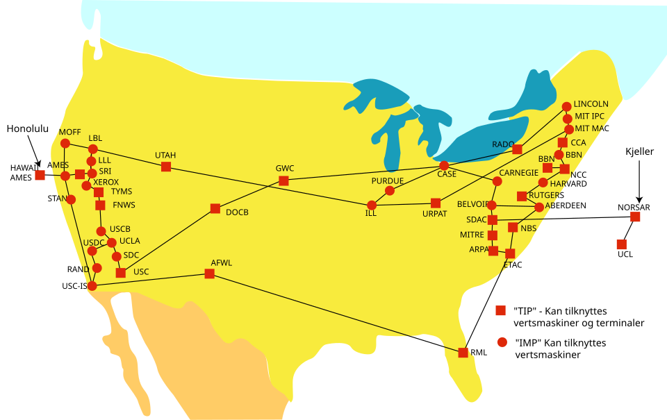
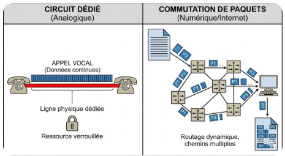
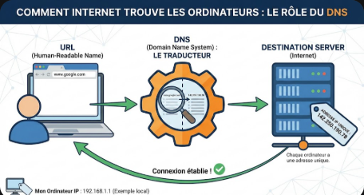
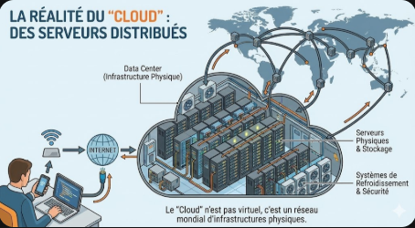

# Préfo-base-du-web

## Internet et le web - Introduction

### Historique de l'internet

Vous l'aviez compris, le web n'a pas émergé instantanément. Voici pour mémoire les principales étapes de son histoire :

**1969** : création de l’ancêtre d’Internet, appelé alors **ARPAnet**. C’est un réseau **militaire** qui se veut décentralisé (autrement dit, il n’a pas de lieu de commande central). Le réseau a ensuite évolué pour devenir un lieu d’**échange universitaire** avant de devenir progressivement grand public sous le nom d’Internet.

#### Arpanet en 1974

**1972** : apparition des e-mails `@` pour échanger des messages.

**1983** : ARPANET adopte le **TCP/IP** qui sera la base d'Internet - [Wikipédia TCP/IP](https://fr.wikipedia.org/wiki/TCP/IP)

**1990** : Arpanet ferme officiellement, et se transforme en internet civile.

**1991** : lancement du Web public, pour afficher des pages d’information, créé par **Tim Berners-Lee** , travaillant au **CERN (Centre européen pour la recherche nucléaire)** sous le nom de **World Wide Web** (Le fameux `www` dans les URLs).

C’est à ce moment que la notion de « pages web » et de « liens hypertextes » (permettant de naviguer entre chaque page) apparaît. C’est la naissance de la toile !

**1994** : création du **W3C (World Wide Web Consortium)** - [W3C](https://www.w3.org/), organisme qui a pris le relais de **Tim Berners-Lee** pour faire évoluer les technologies du web (HTML, CSS, PNG, XML et autres formats de fichiers).

### La définition technique : Le "Réseau des Réseaux"

Fondamentalement, Internet n'est pas un réseau unique, mais **une fédération de milliers de réseaux indépendants (appelés AS ou Autonomous Systems) qui acceptent de s'interconnecter**.

Le terme vient de Inter-connected Networks. Pour que ces réseaux hétérogènes (fibres transatlantiques, Wi-Fi domestique, 4G, réseaux d'entreprise) puissent communiquer, ils reposent sur deux piliers inventés dans les années 1970 (DARPA) :

### Commutation de paquets (Packet Switching)

Contrairement au téléphone analogique (circuit dédié), les données sont découpées en petits morceaux (**paquets**). Chaque paquet peut emprunter une route différente pour arriver à destination où ils sont réassemblés. C'est ce qui rend le réseau résilient.

La suite de protocoles **TCP/IP** : Ce sont les langages de communication (protocoles) qui permettent de transmettre les données.

**IP (Internet Protocol)** : Gère l'adressage (Où aller ?). Chaque machine a une adresse unique (IPv4 ou IPv6).

**TCP (Transmission Control Protocol)** : Gère la fiabilité (Est-ce que tout est arrivé ?). Il établit la connexion et vérifie l'intégrité des données. `TCP/IP` est devenu le standard mondial pour les communications Internet, permettant à des réseaux hétérogènes de communiquer de manière efficace, standardisée et fiable, grâce à son architecture en couches.

### Les protocoles principaux pour utiliser Internet

    HTTP (Hypertext Transfer Protocol) : Protocole de communication entre un navigateur et un serveur web.
    
    HTTPS (Hypertext Transfer Protocol Secure) : Version sécurisée de HTTP pour le web.
    
    FTP (File Transfer Protocol) : Protocole de transfert de fichiers.
    
    SMTP (Simple Mail Transfer Protocol) : Protocole de transfert de courriel (envoi).
    
    POP3 (Post Office Protocol version 3) : Protocole de transfert de courriel (réception).
    
    IMAP (Internet Message Access Protocol) : Protocole d'accès aux courriels.

    SSH (Secure Shell) : Protocole de connexion sécurisée.

    DNS (Domain Name System) : Protocole de résolution de nom de domaine.

 

### Comment identifier un ordinateur sur Internet ?

Chaque ordinateur sur Internet a une adresse unique, appelée adresse IP. Par exemple, l'adresse IP de mon ordinateur est 192.168.1.1.

On peut utiliser un nom de domaine (par exemple, <www.google.com>) pour identifier un ordinateur sur Internet.

On nomme cela un **nom de domaine** nous donnant une **URL (Uniform Resource Locator)** lisible par un humain.

On utilise le **DNS (Domain Name System)** pour traduire un nom de domaine en adresse IP.

### Ne pas confondre les concepts

En résumé, le **web** n'est pas **Internet**. Le **web** est un protocole de communication entre un navigateur et un serveur web. Les protocoles du web sont **HTTP** et **HTTPS**.

Il existe d'autres protocoles pour utiliser Internet, comme **FTP** (File Transfer Protocol) ou **SMTP** (Simple Mail Transfer Protocol).

Le **cloud** est un service de stockage et de traitement de données sur Internet. L'image d'un nuage est une métaphore pour représenter l'accessibilité des données sur Internet. Les fichiers stockés dans le cloud le sont sur des serveurs distants et peuvent être accédés depuis n'importe où dans le monde.

